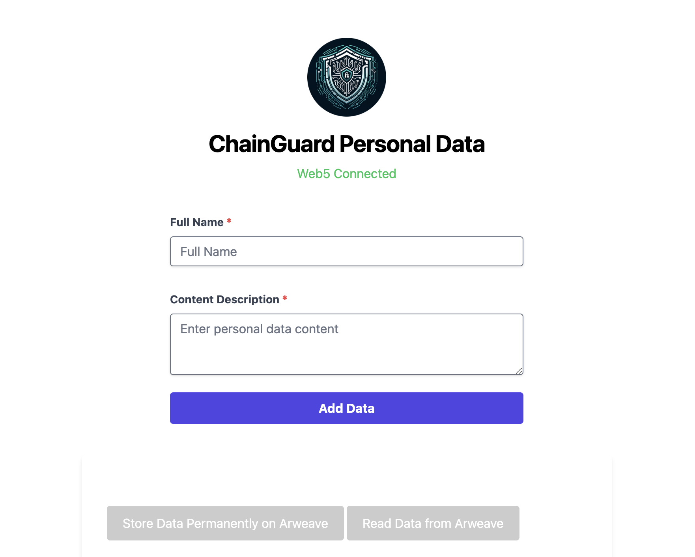
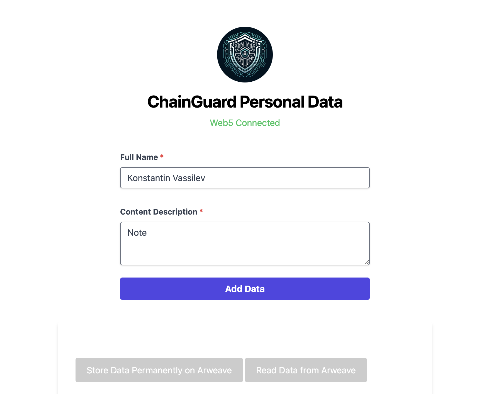
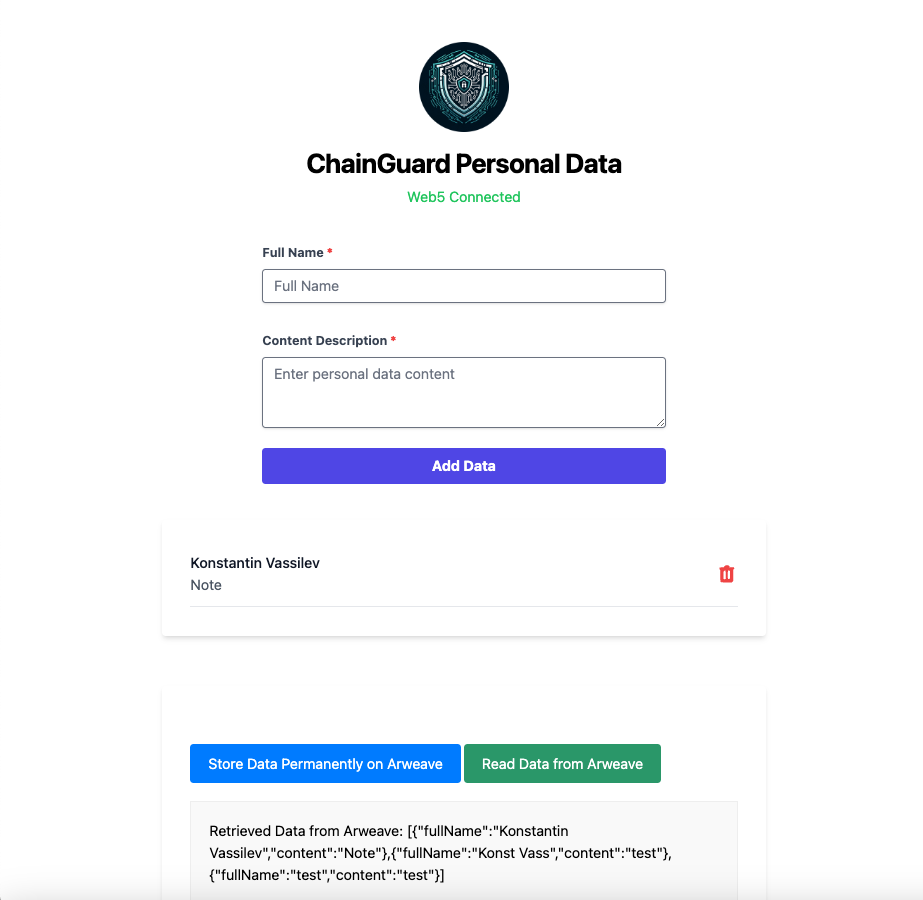
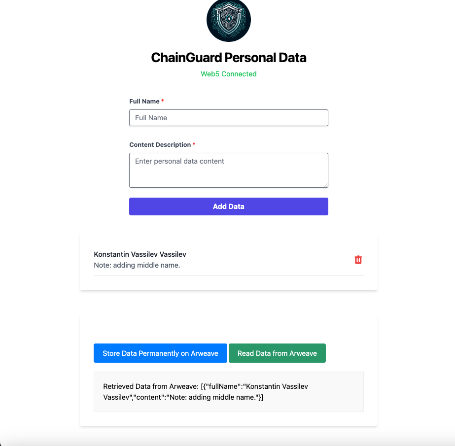

# AIT-ChainGuard
Secure your digital legacy with AIT-ChainGuard: the ultimate decentralized solution for enduring personal data autonomy and integrity.

Copyright© 2024 AITrailblazer, LLC.

# AIT-ChainGuard Project Story

## Inspiration
AIT-ChainGuard was born from the vision to redefine personal data management in a world increasingly concerned about privacy and ownership. We were driven by the desire to harness the potential of decentralized technologies to give individuals absolute control and security over their data. The escalating frequency of data breaches and the opaque nature of data handling in centralized systems inspired us to create a solution that is not only secure but also transparent and user-centric. We wanted to empower users by returning the ownership of data back into their hands, leveraging the power of Web5.js and Arweave to make this vision a reality.

## What it does
AIT-ChainGuard is an avant-garde platform enabling users to manage their personal data through a decentralized framework. It empowers users to securely store, manage, and selectively share their data, such as medical records, financial information, and legal documents. It combines the dynamic and real-time data interaction capabilities of Web5 with the immutable, long-term data storage of Arweave, ensuring users' data remains confidential, intact, and accessible only by authorized parties.

## How we built it
AIT-ChainGuard is built using Vue.js to ensure a dynamic and responsive user experience coupled with Web5.js and Arweave on the backend. The integration of these technologies provides a dual-layered defense and empowerment strategy - dynamic for real-time interaction and immutable for long-term data storage. We focused on creating a seamless and intuitive interface, robust data encryption, and secure transaction signing, especially harnessing the capabilities of ARConnect for user-friendly and secure interactions with the Arweave network.

## Challenges we ran into
Integrating multiple decentralized technologies to work cohesively while maintaining high security and performance was a significant challenge. Creating a user-friendly interface that simplifies the complexities of blockchain and decentralized networks and ensuring flexible yet secure data sharing mechanisms were among the hurdles we faced. Adapting to the evolving landscape of decentralized applications and ensuring the scalability and interoperability of AIT-ChainGuard was also a complex task.

## Accomplishments that we're proud of
We are immensely proud of developing a cutting-edge solution that addresses critical data management issues and sets a new standard in personal data autonomy. Our platform's ability to provide a secure, decentralized, and user-centric approach to data management is a testament to our vision and hard work. We are particularly proud of the intuitive user experience that makes decentralized data management accessible to everyone.

## What we learned
The development of AIT-ChainGuard has been a journey of learning about the potentials and intricacies of decentralized systems, user experience design, and data security. We gained deeper insights into cryptographic security, efficient data storage strategies, and the application of decentralized technologies in real-world scenarios. This project has been a catalyst for understanding the importance and impact of empowering users with control over their data.

## What's next for AIT-ChainGuard
The future of AIT-ChainGuard includes expanding its capabilities to support a wider array of data types and integrations with an extensive range of decentralized applications and services. We aim to enhance the platform's scalability, interoperability, and introduce advanced features such as AI-driven personal data insights. Our commitment is to keep innovating and adapting to ensure AIT-ChainGuard remains at the cutting edge of decentralized personal data management solutions.


# Built With

AIT-ChainGuard is a comprehensive project developed using a variety of languages, frameworks, platforms, and technologies, ensuring a robust and scalable solution for decentralized personal data management. Here's a breakdown of the core components:

## Languages
- **JavaScript**: The primary programming language used for developing the application logic and user interface.
- **HTML5**: For structuring the web application's content.
- **CSS3**: For styling and making the application visually appealing.

## Frameworks and Libraries
- **Vue.js**: A progressive JavaScript framework used for building the user interface and single-page applications.
- **Web5.js**: A decentralized web client library used for managing and interacting with Web5 decentralized identities and data.
- **Arweave.js**: JavaScript library for interacting with the Arweave network for data storage and retrieval.
- **Tailwind CSS**: A utility-first CSS framework for creating custom designs with minimal effort.
- **Vue Toastification**: A Vue.js toast library for providing feedback in a user-friendly way.

## Platforms
- **Arweave**: A decentralized storage network that ensures data permanence.
- **Web5**: A decentralized platform that provides identity and data storage solutions without central servers.

## Cloud Services
- **Node.js**: Server environment for running JavaScript code outside of a browser.

## Databases
- **Arweave Data Storage**: For storing data permanently on the blockweave.

## APIs
- **ARConnect API**: Used for integrating the ArConnect wallet for secure transaction signing and dispatching.
- **Web5.js API**: For managing decentralized identities and records.

## Other Technologies
- **Git**: For version control and source code management.
- **GitHub**: For repository hosting and collaboration.
- **Vite**: A modern frontend build tool that provides a faster and leaner development experience.

By leveraging these technologies, AIT-ChainGuard ensures a high-performance, secure, and user-friendly experience for managing personal data in a decentralized manner.


## Introduction

AIT-ChainGuard is an innovative solution in the ever-evolving domain of decentralized personal data management, leveraging the potent capabilities of Web5.js and Arweave technologies. This application is designed to provide users with ultimate control and security over their personal data, encompassing a wide range of sensitive information like health records, financial details, legal documents, and educational credentials. AIT-ChainGuard is committed to delivering an unmatched level of security, perpetual data accessibility, and rigorous privacy protocols. It embodies a revolution in managing and securing personal information, ensuring that users' data remains eternally preserved, readily accessible, and firmly under their control. By capitalizing on the unique strengths of both Web5 and Arweave, AIT-ChainGuard is set to redefine the standards of personal data autonomy.

## Why "AIT-ChainGuard"?
The name "AIT-ChainGuard" reflects the core mission and technology behind the application. Breaking down the name:

### AIT: 
Stands for Advanced Information Technology. It signifies the cutting-edge technological framework and sophisticated algorithms that form the backbone of the application.

### Chain: 
Represents the blockchain technology and decentralized nature of the application. It symbolizes the application's use of chains of data blocks (blockweave in the case of Arweave) and its commitment to creating a secure chain of custody for user data.

### Guard: 
Reflects the application's primary objective - to guard and protect user data. It emphasizes the security, reliability, and privacy aspects of the application, assuring users of the safekeeping of their personal information.

Together, "AIT-ChainGuard" conveys the application's role as a guardian of user data through advanced technology and blockchain integration. It stands as a robust shield against threats to personal data while providing a flexible, user-centric interface for managing and accessing that data.

By blending dynamic data interaction with Web5 and permanent, immutable storage with Arweave, AIT-ChainGuard offers a dual-layered approach to data management. This approach ensures that users' personal data is not only secure and private but also perpetually accessible and under their control. AIT-ChainGuard is a testament to the transformative potential of decentralized technology, paving the way for a future where individuals have complete sovereignty over their personal information.

## Features

### Self-Sovereign Identity
- **Empowerment**: Elevates identity management to a personal level, replacing centralized systems with user-driven autonomy and enhanced privacy.
- **Security**: Implements advanced cryptographic mechanisms, assuring users retain exclusive control over their identities and related data.

### Immutable Data Storage
- **Permanency**: Harnesses Arweave's blockweave technology for reliable and unalterable data storage, ensuring perpetuity of data integrity.
- **Integrity**: Validates and preserves the pristine state of data, offering a trustworthy foundation for all subsequent utilization.

### Selective Sharing with Consent
- **Control**: Enables users to specify data access permissions, ensuring sharing is always consensual and under strict user-defined parameters.
- **Flexibility**: Offers detailed access controls, permitting the sharing of precise data elements under exact conditions.

### Enduring Accessibility
- **Longevity**: Employs Arweave's endowment model, assuring data remains accessible over extensive periods without ongoing fees.
- **Reliability**: Assures consistent data retrievability, providing a reliable and lasting solution for personal data stewardship.

### Universal Trust and Reliability
- **Trustworthiness**: Integrates Web5's decentralized security with Arweave's immutable storage, forming a fortified and secure data ecosystem.
- **Reliability**: Constructs a durable infrastructure for personal data management, fostering confidence and steadfastness in data integrity.

### Versatile and Integrative
- **Scalability**: Adapts to a wide array of use cases, molding to individual and sector-specific requirements with ease.
- **Interoperability**: Guarantees smooth integration with various systems and services, enabling efficient collaborations and integrations.

## Strategic Use of Web5 for Dynamic Data Management

### Dynamic Data Management
- **Agility**: Enables swift and flexible data modifications, ideal for accommodating dynamic user interactions and evolving data needs.
- **Continuity**: Maintains a consistent and engaging user experience with real-time access and updates, crucial for applications demanding continuous user interaction.

### Decentralized Identity Verification and Management
- **Sovereignty**: Restores digital identity ownership to users, reducing dependency on centralized models and enhancing security.
- **Security**: Amplifies security with sophisticated cryptographic solutions, ensuring user access is secure and verifiable.

### Enhanced Security and Privacy
- **Protection**: Bolsters data security through decentralized architectures, mitigating risks associated with centralized data repositories.
- **Confidentiality**: Delivers privacy-centric options, allowing users to govern their data's visibility and access.

### Real-Time Data Access and Sharing
- **Collaboration**: Promotes an environment conducive to collaboration with quick data sharing capabilities, enhancing interactions and productivity.
- **Integration**: Simplifies service integration by providing swift data access and synchronization, optimizing cross-platform operations.

### Cost-Effective and Scalable Solutions
- **Efficiency**: Reduces data management costs with a scalable and adaptable infrastructure, suited to diverse demand scenarios.
- **Growth**: Supports system and user base expansion, ensuring the infrastructure develops in line with demand without compromising efficiency.

### User Experience and Accessibility
- **Ease of Use**: Guarantees straightforward data access and management, improving user satisfaction and adoption rates.
- **Adaptability**: Ensures compatibility across a variety of devices and platforms, accentuating user convenience and accessibility.

## Strategic Use of Arweave for Permanent Data Storage

### Data Permanence Requirement
- **Authenticity**: Preserves crucial records like medical, financial, legal, personal, or historical documents, ensuring authenticity and compliance over time.
- **Compliance**: Meets stringent regulatory and legal requirements for data retention and immutability, pivotal in numerous sectors.

### Data Integrity and Verification
- **Trust**: Establishes a dependable and verifiable system of records, crucial for maintaining long-term certifications, credentials, and audit trails.
- **Perpetuity**: Maintains data integrity for an indefinite period, serving as a consistent and trustworthy source of truth.

### Cost and Efficiency Considerations
- **Savings**: Provides a one-time fee model for data storage, significantly reducing long-term costs compared to traditional recurring fee models.
- **Efficiency**: Offers an effective storage solution for static data, optimizing resources and budgeting for long-term storage requirements.

### User-Controlled and Sensitive Data
- **Confidentiality**: Ensures sensitive information remains secure and unaltered, adhering to the highest data protection standards.
- **Empowerment**: Places data ownership firmly in the hands of users, fostering a secure and empowering environment for managing sensitive information.

### Application-Specific Use Cases
- **DApps**: Vital for decentralized applications requiring a stable and immutable storage solution.
- **Content Creation**: Beneficial for content creators and archivists, providing a reliable and immutable repository for digital creations.

AIT-ChainGuard's strategic application of Web5 and Arweave manifests a holistic data management solution that is dynamic, secure, and perennial. Web5's agility and user-centric model for real-time data interaction seamlessly intertwine with Arweave's immutable and enduring storage capability. This symbiosis ensures not only a robust defense against evolving digital threats but also a user-friendly environment for managing personal data with full autonomy. AIT-ChainGuard encapsulates the strengths of decentralized technology, offering a resilient, flexible

# ARConnect Wallet and Arweave

ARConnect is a critical browser extension wallet specifically designed for the Arweave network. It allows users to interact seamlessly with decentralized applications and manage transactions. Arweave is a novel type of storage that backs data with sustainable and perpetual endowments, enabling users and developers to store data forever. Here's how to use ARConnect and some key information about Arweave:


### Key Features:

- **Secure Wallet Management**: Manage your Arweave wallet keys securely.
- **Transaction Signing**: Authorize transactions safely without exposing private keys.
- **DApp Interaction**: Engage with decentralized applications on the Arweave network effortlessly.
- **Intuitive User Interface**: Enjoy a user-friendly interface for managing assets and interactions.

### Getting Started with ARConnect:

1. **Installation**: 
## ARConnect Wallet

https://chromewebstore.google.com/detail/arconnect/einnioafmpimabjcddiinlhmijaionap

   - Visit your browser's extension marketplace, search for "ARConnect," and install it.

2. **Creating or Importing a Wallet**: 
   - Open ARConnect and opt to create a new wallet or import an existing one using your keyfile. Securely back up any generated passphrases or keys.

3. **Funding Your Wallet**: 
   - Acquire $AR tokens and transfer them to your wallet to interact with the Arweave network. These tokens are necessary for transactions and data storage.

### Integrating ARConnect with AIT-ChainGuard:

1. **Connecting**: 
   - Within AIT-ChainGuard, initiate the wallet connection process to link your ARConnect wallet.
   
2. **Transaction Management**: 
   - Approve or sign transactions prompted by ARConnect when uploading data or performing other actions within AIT-ChainGuard.

3. **Data Interaction**: 
   - Manage your data confidently, with ARConnect ensuring secure transaction handling.

4. **Monitoring Activity**: 
   - Use ARConnect to view your transaction history and manage your wallet balance.

5. **Security Practices**: 
   - Always back up your data, keep private information confidential, and interact only with trusted applications.

## Arweave - Perpetual Storage

Arweave is a unique storage protocol that provides scalable and permanent data storage sustainably. It's designed for permanence, sustainability, and operates on a decentralized network.

### Key Highlights:

- **Permanence**: Once data is stored on Arweave, it remains accessible forever without risk of loss or change.
- **Sustainability**: The endowment model ensures data storage is perpetually funded, making it a one-time investment for continuous access.
- **Decentralized Network**: Enhances security and reduces risks associated with centralized data storage.

### Free Uploads on Node 2:

Arweave offers free uploads for data under 100 KiB on Node 2 to encourage usage and familiarity with the platform. Note:

- **Rate Limit**: Free uploads are limited to 600 transactions per minute, with the count resetting each minute.
- **Exceeding Limits**: If you exceed the limit within a minute and have a funded balance on Node 2, it will be used for the transaction. Without balance, you'll encounter a "402 - Free transaction limit exceeded, funds required" error.

ARConnect and Arweave form an integral part of the AIT-ChainGuard ecosystem. ARConnect provides the interface and security for network interaction, while Arweave offers the storage capabilities for perpetual data management. Together, they empower users with unmatched security and permanence in managing and preserving data.


# Understanding ARConnect Permissions

In the AIT-ChainGuard application, the ARConnect wallet is integrated to interact with the Arweave network. It requires specific permissions to perform various actions securely and efficiently. Below is an explanation of the permissions requested by the application and why they are necessary:

## Required ARConnect Permissions:

When `dispatchTransaction` function is called in the AIT-ChainGuard, the following permissions are requested from the ARConnect wallet:

1. **ACCESS_ADDRESS**: 
    - **Purpose**: This permission allows the application to retrieve the wallet's address. It's essential for identifying the user's wallet and facilitating transactions tied to their specific account.
    - **Usage**: In AIT-ChainGuard, accessing the user's address is critical for creating and managing transactions related to personal data storage and retrieval.

2. **SIGN_TRANSACTION**: 
    - **Purpose**: This permission is crucial for authorizing and signing transactions. It ensures that the user has explicitly approved any action that alters their data or involves token transfer.
    - **Usage**: Every time a user wants to upload data to Arweave or perform any transaction, SIGN_TRANSACTION permission ensures that the operation is authenticated and executed securely.

3. **DISPATCH**: 
    - **Purpose**: The DISPATCH permission is specifically for submitting transactions to the Arweave network. It allows the ARConnect wallet to send the signed transactions to be stored on the blockchain.
    - **Usage**: This is used in AIT-ChainGuard when the application needs to dispatch the transaction for data storage. It ensures that the data, once signed, is properly sent and recorded on the Arweave network.

## Why These Permissions Are Essential:

- **Security**: By explicitly requesting these permissions, ARConnect ensures that the user is aware of and consents to the actions performed by the application on their behalf. It prevents unauthorized transactions and access to user data.
- **Functionality**: These permissions are integral to the application's functionality. Without them, AIT-ChainGuard wouldn't be able to perform the necessary operations to manage and store personal data securely on the Arweave network.
- **User Control**: The permission model empowers users by giving them control over the application's access to their wallet. Users can revoke these permissions at any time, thereby stopping any further transactions or data access.

By understanding and granting these permissions, users can confidently use AIT-ChainGuard to manage their personal data, assured by the security and functionality provided by the ARConnect wallet and Arweave network.

# Function: dispatchTransaction

The `dispatchTransaction` function is a critical component of the AIT-ChainGuard application, enabling users to securely dispatch their personal data transactions to the Arweave network. Here's a detailed breakdown of its process:

## Overview:
This function encapsulates the entire process of sending a transaction to the Arweave network, which involves checking for wallet availability, creating a transaction with user data, signing it, dispatching it to the network, and storing the transaction ID for future reference.

## Step-by-Step Process:

1. **Check for ArConnect Availability**:
    - `if (!window.arweaveWallet) { throw new Error("ArConnect extension is not installed or not enabled.") }`: This line checks if the ArConnect wallet is available in the browser. If not, it throws an error, prompting the user to ensure that ArConnect is installed and enabled.

2. **Request User Permissions**:
    - `await window.arweaveWallet.connect(["ACCESS_ADDRESS", "SIGN_TRANSACTION", "DISPATCH"])`: This line requests the user to grant permission for the application to access their address, sign transactions, and dispatch them to the network via the ArConnect wallet.

3. **Create Transaction with Aggregated Data**:
    - `let tx = await arweave.createTransaction({ data: userInput.value })`: This line initializes a new transaction with the user's input data.
    - The transaction is then enhanced with tags (`App-Name`, `Content-Type`, `Version`, `Type`) to provide metadata, identifying the application, content type, version, and nature of the transaction.

4. **Sign and Dispatch the Transaction**:
    - `await arweave.transactions.sign(tx)`: This line signs the transaction with the user's private key from the ArConnect wallet, a crucial step for security and authorization.
    - `let result = await window.arweaveWallet.dispatch(tx)`: This line dispatches the signed transaction to the Arweave network. The network then processes and stores the transaction if it's valid.

5. **Store the Transaction ID for Future Reference**:
    - `transactionId.value = result.id`: This line captures the unique Transaction ID assigned by the network and stores it in the application state. This ID is critical for retrieving or referencing the transaction in the future.
    - `await storeTransactionIdInWeb5(transactionId.value)`: This line stores the transaction ID in Web5, ensuring consistency and facilitating recovery through decentralized web services.

## Error Handling:
- The try-catch block encapsulates the entire transaction dispatch process, catching and logging any errors encountered during the operation. This robust error handling ensures that any issues are appropriately addressed, and users are informed of any failures in the transaction process.

## Conclusion:
The `dispatchTransaction` function is a testament to AIT-ChainGuard's commitment to secure, user-friendly, and reliable personal data management. By leveraging the Arweave network and ArConnect wallet, it ensures that users' data is not only securely stored but also perpetually accessible, reflecting the core principles of AIT-ChainGuard's mission.

# Structure

The AIT-ChainGuard project is structured to facilitate easy navigation, development, and scalability. The structure represents a typical Vue.js project utilizing Vite as the build tool and Tailwind CSS for styling. Here's a breakdown of the primary directories and files:

## Root Directory: AIT-ChainGuard
```
.
├── DATA
├── README.md
├── node_modules
├── package.json
├── pnpm-lock.yaml
└── vite-project
```

## Root Directory: AIT-ChainGuard

- **DATA/**: Intended for storing data related to the application, including databases, configuration files, or any other data resources.
- **README.md**: Provides an overview of the project, instructions for setup, running, and contributing to AIT-ChainGuard.
- **node_modules/**: Directory where npm dependencies are installed. It is auto-generated upon `npm install` or `pnpm install`.
- **package.json**: A manifest file for the project including metadata, project's name, version, dependencies, and scripts defining how the project is run and built.
- **pnpm-lock.yaml**: An auto-generated file ensuring consistent installs across machines when using pnpm as the package manager.
- **vite-project/**: The main directory for the application's source code, powered by Vite for a faster and leaner development experience.

## Vite Project Directory

vite-project
```
├── README.md
├── index.html
├── node_modules
├── package-lock.json
├── package.json
├── pnpm-lock.yaml
├── postcss.config.cjs
├── public
├── src
├── tailwind.config.cjs
└── vite.config.js
```
- **README.md**: Specific to the vite-project, usually containing information related to the development and building processes.
- **index.html**: Entry HTML file for the web application, including a div with an id of "app" where the Vue application is mounted.
- **node_modules/**: Directory for the project's npm dependencies, specific to the vite-project.
- **package-lock.json**: Auto-generated file to lock installed versions of each npm package, ensuring consistency across installations.
- **package.json**: The manifest file for the vite-project, containing metadata and scripts related to it.
- **pnpm-lock.yaml**: Ensures consistent installs using pnpm for the vite-project.
- **postcss.config.cjs**: Configuration file for PostCSS, used alongside Tailwind CSS.
- **public/**: Directory for static assets like favicon, robots.txt, etc., not handled by Webpack.
- **src/**: Source directory containing the Vue application's components, assets, and main entry file.
- **tailwind.config.cjs**: Configuration file for Tailwind CSS defining themes, customizations, and plugins.
- **vite.config.js**: Configuration file for Vite defining how the application is built, served, and optimized.


index.html
```html
<!DOCTYPE html>
<html lang="en" class="h-full">

<head>
  <meta charset="UTF-8" />
  <meta name="viewport" content="width=device-width, initial-scale=1.0" />
</head>

<body class="h-full">
  <div id="app"></div>
  <script type="module" src="/src/main.js"></script>
</body>

</html>
```

## src Directory

src
```
.
├── App.vue
├── assets
├── components
├── main.js
└── style.css
```
- **App.vue**: The main Vue component acting as the root of the application.
- **assets/**: Directory for static assets like images, fonts, etc., part of the application.
- **components/**: Directory for Vue components, organizing the application into smaller, reusable pieces.
- **main.js**: The entry point for the Vue application where the app is instantiated and mounted to the DOM.
- **style.css**: The main stylesheet file for the application using Tailwind CSS classes for styling.

main.js
```js
import { createApp } from 'vue'

import Toast from 'vue-toastification';

import './style.css'

import 'vue-toastification/dist/index.css';

import App from './App.vue'

createApp(App)
  .use(Toast)
  .mount('#app');

```

style.css
```css
@tailwind base;
@tailwind components;
@tailwind utilities;
```


## App.vue

This Vue.js script serves as the backbone for the AIT-ChainGuard application, a sophisticated platform for managing personal data through decentralized Web5 and Arweave technologies. It's structured to handle the lifecycle of personal data entries, from creation to permanent storage.

### Functional Breakdown:

1. **State Management**: 
   - Utilizes Vue's reactivity system through `ref()` to manage the state of user data, messages, transaction IDs, and more, ensuring a responsive user interface.

2. **Data Management Flow**:
   - **Connection Initialization**: Attempts to connect to the Web5 decentralized network and Arweave on component mount, establishing a secure channel for data management.
   - **Data Entry and Storage**: Provides functionality for users to input personal data, manage it through Web5, and store it permanently on Arweave.
   - **Transaction Handling**: Manages the lifecycle of data transactions, including creating, signing, and dispatching data to the Arweave network, ensuring data permanency.
   - **Data Retrieval**: Facilitates the retrieval of stored data from Arweave, allowing users to verify and access their permanently stored personal data.

3. **User Interface Components**:
   - **Dynamic Form**: A form for users to enter and submit personal data, including name and content description.
   - **Data Listing**: Dynamically displays the list of personal data entries added by the user, offering an interface to manage (delete or modify) these entries.
   - **Permanent Storage Interaction**: Buttons and mechanisms to store data permanently on Arweave and read the stored data, emphasizing the application's commitment to data permanence and retrieval.
   - **Status and Error Handling**: Displays connection status, error messages, or warnings, enhancing user feedback and interaction.

### Style and Presentation:

- The application employs Tailwind CSS for styling, ensuring a modern and clean user interface.
- The `.container` class defines the main content area with responsive and aesthetic design considerations.
- The `.input-field` and `.buttons` classes cater to form inputs and action buttons, providing a user-friendly experience.
- The `.output` class is designated for displaying retrieved data from Arweave, formatted for readability and user accessibility.

In essence, the script is a well-orchestrated symphony of Vue.js and modern web technologies aimed at providing an end-to-end solution for secure, decentralized personal data management. It reflects the core principles of AIT-ChainGuard: security, user empowerment, and seamless interaction with decentralized data.

# Running the AIT-ChainGuard Project

## Step 1: Setting Up the Project

Install Node.js: Make sure Node.js is installed on your system to use npm (Node Package Manager).

Install Vue CLI: Install the Vue CLI globally on your machine if you haven't already. It's a command-line tool for quickly scaffolding Vue applications. You can install it using 

```bash
pnpm install -g @vue/cli
```

Clone AIT-ChainGuard project:

```bash
git clone https://github.com/aitrailblazer/AIT-ChainGuard.git

```

Navigate to AIT-ChainGuard Project Folder:
```bash
cd AIT-ChainGuard
cd vite-project
```

##  Step 2: Adding Tailwind CSS and Heroicons

Install Tailwind CSS and Heroicons
Using pnpm, install Tailwind CSS and Heroicons:

```bash

pnpm uninstall @heroicons/vue
pnpm install @heroicons/vue@latest

pnpm install tailwindcss postcss autoprefixer 
```
style.css
```css
@tailwind base;
@tailwind components;
@tailwind utilities;
```
## Step 3: Install ARConnect wallet in Chrome
```
https://chromewebstore.google.com/detail/arconnect/einnioafmpimabjcddiinlhmijaionap
```

## Step 4: Running the App
Run the application with the following command:

```bash
pnpm run dev

VITE v4.3.7  ready in 197 ms

  ➜  Local:   http://localhost:5173/
  ➜  Network: use --host to expose
  ➜  press h to show help
```

Open Crome browser and navigate to:
```
http://localhost:5173/

```

# AIT-ChainGuard Quick Start Guide

Follow this step-by-step guide to manage your personal data with AIT-ChainGuard after opening the Chrome browser and navigating to `http://localhost:5173/`.

## Initial Setup

### First Run
1. **Enter Personal Data**: Upon your first visit, you'll be prompted to enter your personal data.
   - Input your details into the respective fields.
   - Click `Add Data` to proceed.

2. **Add Data to Web5**: Integrate and manage your data within the decentralized Web5 framework.
   - Review your data and confirm the submission.

3. **Store Data Permanently to Arweave**: Ensure the longevity and integrity of your data by storing it on the Arweave network.
   - Approve the transaction via your ARConnect wallet.

4. **Read Permanent Data from Arweave**: Verify that your data has been securely stored by reading it back from Arweave.
   - Navigate to the 'Read Data' section and confirm your data is retrievable.

### Adding More Records
1. **Update Personal Data**: Add more records or modify existing ones to expand your data profile.
   - Input additional details such as a middle name or other pertinent information.

2. **Store Updated Data to Arweave**: Securely store the updated data on Arweave.
   - Confirm and sign the transaction through ARConnect.

3. **Read Updated Data from Arweave**: Verify the changes by reading the updated data back from Arweave.

### Modifying Data
1. **Delete a Record from Web5**: If necessary, remove any personal data directly from the Web5 platform.
2. **Update Storage on Arweave**: Reflect any deletions or modifications by updating your data storage on Arweave.
3. **Verify Changes on Arweave**: Re-read the data from Arweave to ensure all modifications are accurately captured.

## Subsequent Uses

### Second Run and Beyond
1. **Refresh Browser**: For subsequent visits, refresh your browser to re-initiate interaction with the application.
2. **Read Permanent Data**: Directly access and verify your permanent data stored on Arweave.
3. **Modify Data**: Continue to add, modify, or delete personal data as needed.

Through these steps, manage and verify your personal data efficiently with AIT-ChainGuard, ensuring full control and security over your digital information.


# AIT-ChainGuard User Interface

This section provides a visual journey through the AIT-ChainGuard application, showcasing the user interface and interaction flow for managing and storing personal data using Web5 and Arweave.


First run:



Upon the first run, users are prompted to enter their personal data. This step is foundational in initiating the data management process.

First run: Enter data.




First run: Add data to Web5.


After entering the data, users proceed to add this data to Web5. This stage involves integrating and managing the data within the decentralized Web5 framework.

First run: Store data permanantly to arweaver.


First run: Read permanent data from arweaver.



Once the data is managed within Web5, users have the option to store it permanently on Arweave, ensuring the data's longevity and integrity.

After storing the data, users can read and verify the permanent data from Arweave, ensuring that their information is intact and retrievable.


When starting to store the permanent data to ARweave for first time the ARConnect wallet appears, enter your password.


The wallet needs approval for these permissions. 


First run: Add more records to personal data. Adding middle name.


Users can add more records to their personal data, such as a middle name or other pertinent details, expanding their data profile within the application.


Multiple data records can then be read and verified from Arweave, showcasing the application's capability to handle and preserve a variety of personal data types.


First run: Delete a record from Web5.

First run: Store data permanantly to arweaver.

First run: Read permanent data from arweaver.



Users have the flexibility to delete a record from Web5 if necessary, demonstrating control and manageability over their personal data.

Following any modifications or deletions, users can update their permanent data storage on Arweave to reflect the most current state of their data.

Once again, users can read and confirm their permanent data from Arweave, ensuring all changes have been accurately captured and stored.

Second run: Refresh the browser.

Upon a second run or visit, users may refresh their browser to re-initiate interaction with the application, demonstrating the ongoing accessibility of the AIT-ChainGuard.


Second run: Read permanent data from arweaver.

In the second run, users can directly read their permanent data from Arweave, illustrating the enduring and immediate access to their stored information.


Second run: Delete the data from Web5.

During subsequent interactions, users might choose to delete data from Web5, modifying their personal data landscape as needed.


Second run: Read permanent data from arweaver.


Finally, users can re-read the permanent data from Arweave, ensuring that all their data management activities are reflected in their secure and immutable data storage.

Through these steps, AIT-ChainGuard showcases a comprehensive and user-centric approach to personal data management, combining the dynamic capabilities of Web5 with the permanent storage solutions of Arweave. The interface guides users through a seamless experience of adding, managing, storing, and verifying their personal data, emphasizing control, security, and ease of use.
